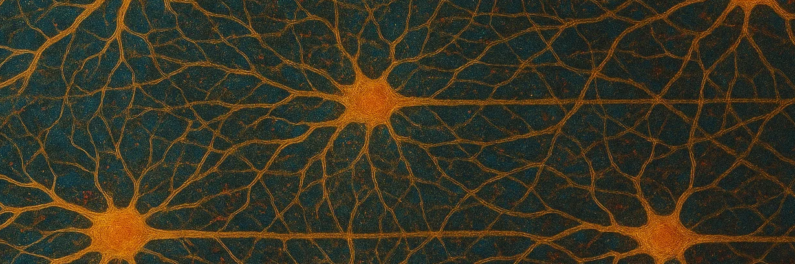

# Math for Machine Learning and Data Science

This repository was created to document and practice the knowledge acquired in the Math for Machine Learning and Data Science course (DeepLearning.AI / Coursera).

## Quickstart

Follow these steps to set up the project:

### 1. Create and activate a Python virtual environment

```bash
python3 -m venv venv
source venv/bin/activate   # On Linux or macOS
# venv\Scripts\activate    # On Windows
```

### 2. Install dependencies

```bash
pip install -r requirements.txt
```

### 3. Run the project

```bash
python -m src.nn
```

> Make sure you are in the project's root directory when running the command.